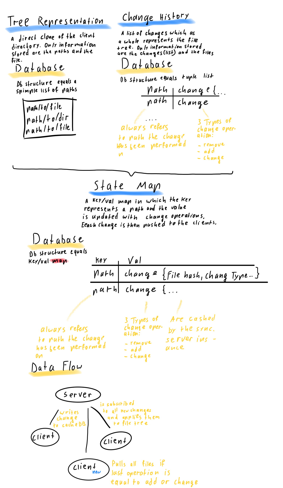

# Go Minimal Sync

Go Minimal Sync is a package with which file structures (directories) can be synced with. The pkg uses a central server like instance with which multiple clients can be synced over as many folders as liked. Every added folder can be assigned to a sync group so that different dirs can be synced over the same instance. The server instance therefor stores all synced files in a temporary directory and the rest of the meta data in a database(stored only for runtime)-

## Concept
The server instance uses a webserver to up- and download files and hosts a (remote cache)[]  key/ val database in order to enable the exchange of information for the clients. The clients push every change in the file tree(of the dirs) to the remote cache, the key is the path which the change has been taking place at and the value a serialized json struct which contains all important information about the change.
There are only three types of changes, `added, removed, changed`  since more are not required. Thus the resulting cache contains only up to date state data of the dirs to sync.

## Features
communication(meta data exchange and files transmission) is fully tls enrcypted (optionally)
synchronisation of multiple directories over multiple clients
all sync-logic is client side the server instance holds only simple state meta data and files
only minimal required data is stored server-side and can be saved easily by copying the remote cache

## Optimisations to be done
- shrinking amount of used memory by introducing more pointers
- Enums instead of strings for operation types
- utilisation of mutex for state type data

## Idea schematic

